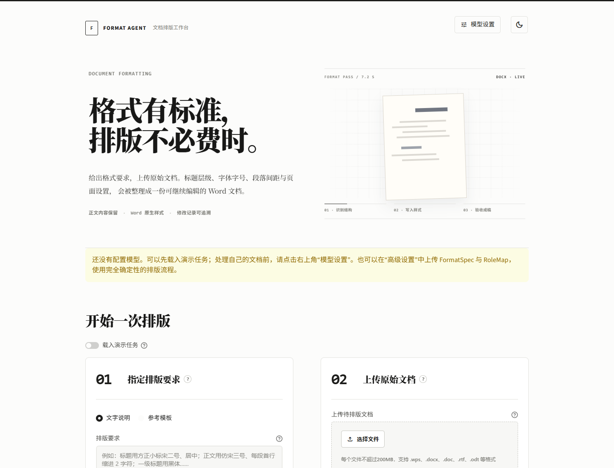
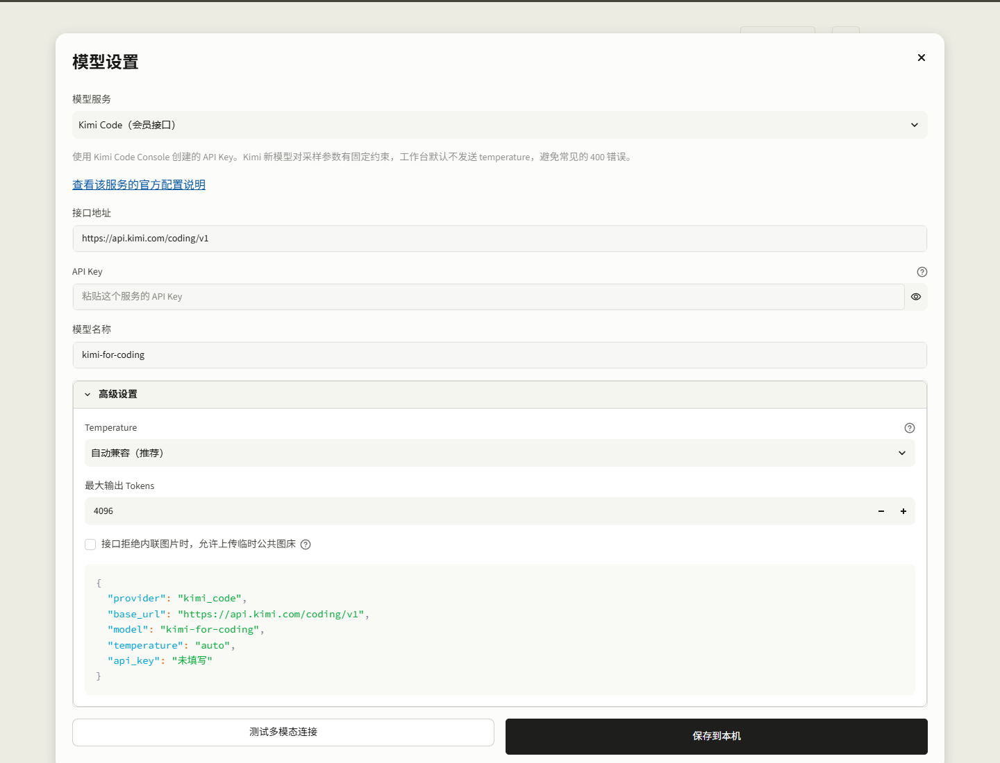
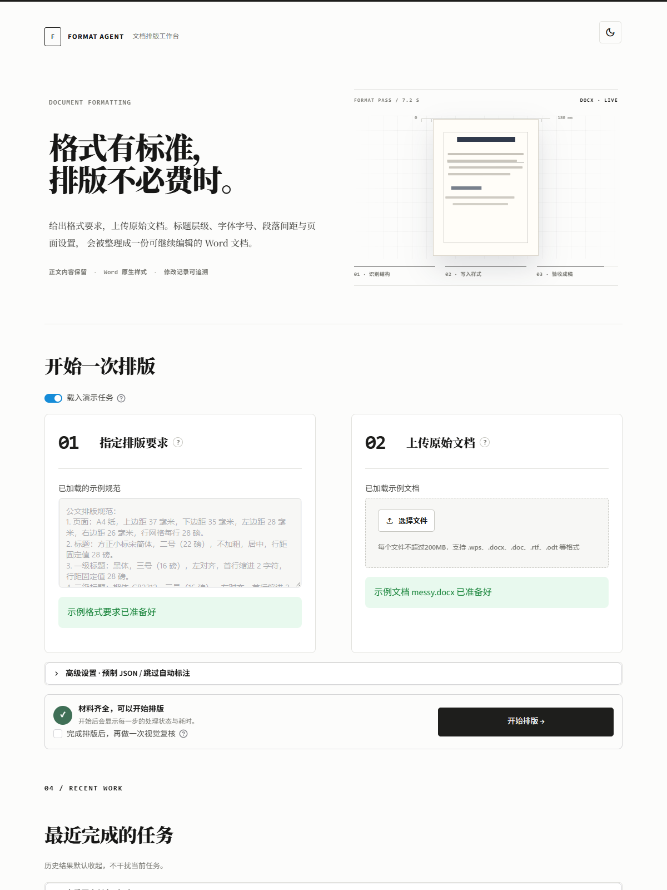
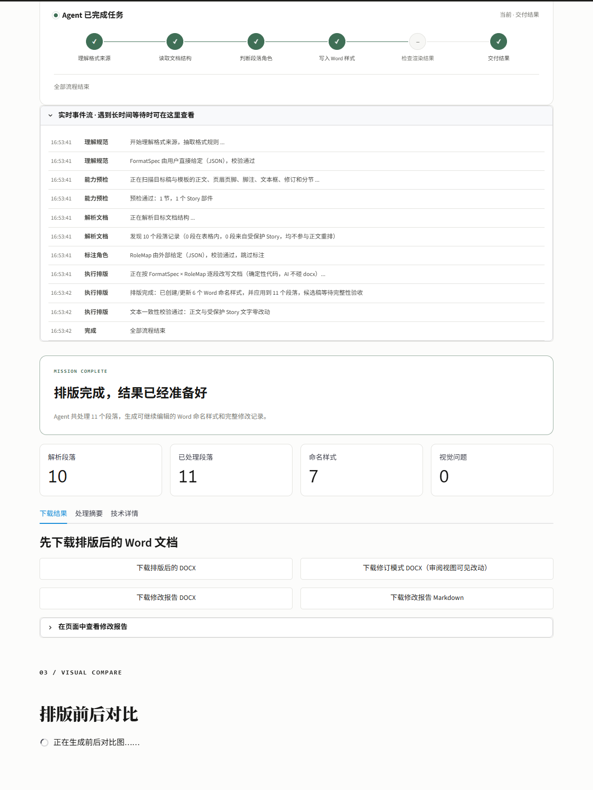
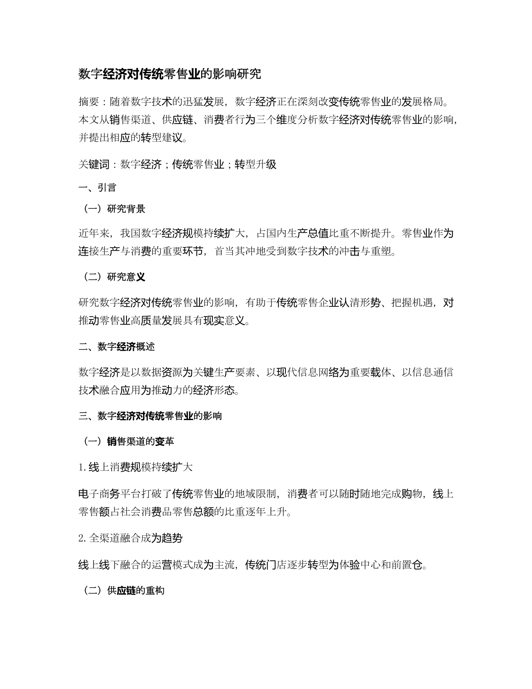
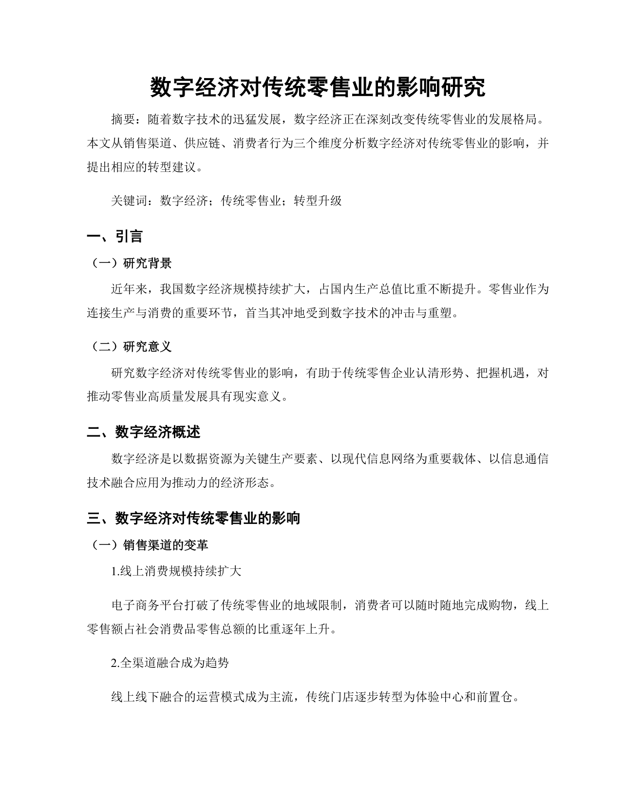

# Format Agent Workbench

把格式要求和原始文档放进同一个工作台，生成可继续编辑的 Word。

**开源，个人及非商业使用免费。**

[下载 Windows 版](https://github.com/KaguraNanaga/format-agent-workbench/releases/latest) · [使用 Agent Skill](https://github.com/KaguraNanaga/format-agent-skill)



Format Agent Workbench 面向需要反复整理 Word 格式的人：上传格式要求或排版模板，再上传待处理文档，工作台会识别标题层级、字体字号、段落间距与页面设置，并交付排版后的 DOCX、修订模式 DOCX 和修改对照报告。

> 完整工作流需要一个能够同时理解文字和图片的多模态模型。内置演示使用项目中的固定样例与规则，不调用外部模型，也不需要 API Key。

## 三分钟开始

### Windows：双击启动

1. 在 GitHub 的 **[Releases](https://github.com/KaguraNanaga/format-agent-workbench/releases/latest)** 页面下载 `format-agent-workbench-windows.zip` 并解压。
2. 双击 `启动工作台.bat`。首次启动会在当前目录创建独立的 `.venv` 并安装依赖。
3. 浏览器打开后，先开启“载入演示任务”，不用填写 API Key 即可体验完整交互。
4. 处理自己的文档时，点击右上角“模型设置”，选择服务并粘贴自己的 API Key。

以后仍然双击 `启动工作台.bat`；需要停止时，在启动窗口中按 `Ctrl+C`，或直接关闭该窗口。

要求：Windows 10/11、Python 3.10 或更高版本。为获得最稳定的 DOC/DOCX 转换与预览效果，建议安装 Microsoft Word；WPS 也可用于部分格式转换。

### macOS / Linux：命令行安装

```bash
python3 -m venv .venv
source .venv/bin/activate
python -m pip install --upgrade pip
python -m pip install -r requirements.txt
python -m streamlit run app.py
```

推荐安装 LibreOffice，用于文档转换和页面渲染。浏览器默认访问 `http://127.0.0.1:8501`。

## 使用自己的文档

真实任务会调用你配置的模型。点击工作台右上角的“模型设置”，然后：

1. 选择 Kimi Code、Kimi API、智谱 GLM、阿里云百炼、Gemini、OpenAI，或其他 OpenAI 兼容接口。
2. 粘贴 API Key。预设会自动填写接口地址和一个支持图片输入的模型名称，仍可自行修改。
3. 可先运行“测试多模态连接”，再点击“保存到本机”。测试会发送项目自带的一张示例图，产生一次很小的模型调用；设置保存后立即生效，不必重启。

API Key 只会写入解压目录中的 `.env`，该文件已被 Git 忽略。高级用户也可以复制 `.env.example` 为 `.env` 后手动编辑。

Temperature 默认使用“自动兼容”，即请求中不发送这个字段，由服务商采用模型默认值。这能避开 Kimi Code、Kimi K3 和部分推理模型因固定温度或不接受该字段而产生的 400 错误；只有服务商明确要求时才需要选择固定数值。



请选择能同时接收文本与图片、并能稳定输出 JSON 的多模态模型。文字规则提取和文档结构识别主要使用文本能力；开启“视觉自检”后，模型还会检查渲染后的页面，因此图片理解能力是完整工作流的必要条件。

默认不会把文档页面上传到公共图床。详见 [隐私说明](PRIVACY.md)。

## 工作流



1. **给出格式标准**：直接描述规则，或上传一份已经排好的 Word 模板。
2. **上传原始文档**：推荐 DOCX；Windows 下也可处理常见的 DOC、WPS、ODT、RTF。
3. **开始排版**：工作台识别结构、写入样式、检查结果，并保留正文内容。
4. **下载交付物**：排版后 DOCX、修订模式 DOCX、Markdown 修改报告。



### 一次排版会得到什么

- 可继续编辑的 DOCX，不是扁平图片或 PDF。
- Word 修订模式版本，可在审阅视图中逐项查看格式改动。
- 修改对照报告，记录段落角色、样式与修改项目。
- 可选视觉自检，对渲染页面进行第二轮检查。

| 排版前 | 排版后 |
| --- | --- |
|  |  |

## Workbench 与 Skill 的区别

- **Workbench**：适合希望直接打开界面、上传文件并下载结果的用户。
- **[Format Agent Skill](https://github.com/KaguraNanaga/format-agent-skill)**：适合已经在 Codex 等 Agent 环境中工作、希望把排版能力纳入自动化流程的用户。

两者解决的是同一类问题，但入口不同。只想使用图形界面时，下载本仓库即可。

## 支持范围与边界

- 最稳定的输入与输出格式是 DOCX；输出统一为 DOCX。
- 旧版 DOC、WPS、ODT、RTF 的可用性取决于本机 Word、WPS 或 LibreOffice。
- 工作台处理排版与结构，不替你改写正文事实，也不会从模板中复制作者姓名、声明等示例内容。
- 高度复杂的公式、宏、嵌入对象或特殊域建议在交付前人工复核。
- 视觉自检需要文档渲染环境和支持图片输入的模型。

## 命令行用法

图形界面之外，也可以直接调用排版 Agent：

```bash
python main.py \
  --spec requirements.txt \
  --target draft.docx \
  --out output/formatted.docx \
  --verify
```

查看全部参数：

```bash
python main.py --help
```

## 开发与验证

```bash
python -m pip install -r requirements.txt
python -m pip install pytest
pytest tests/ -q
```

当前公开版本：`0.2.2`。发布前在 Windows 环境通过自动化测试。

发现安全问题时，请不要公开提交包含真实文档、API Key 或个人信息的 Issue，处理方式见 [SECURITY.md](SECURITY.md)。

## 许可证

本项目采用 [PolyForm Noncommercial License 1.0.0](LICENSE)：源代码公开，个人学习、研究与其他非商业用途免费；商业使用需要另行取得授权。第三方依赖仍遵循其各自许可证。

## 项目沿革

[format-agent-01](https://github.com/KaguraNanaga/format-agent-01) 是黑客松期间完成的初始版本，作为历史记录保留。本仓库是后续持续维护的工作台版本。
